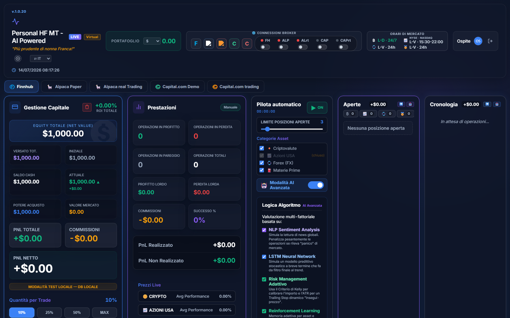
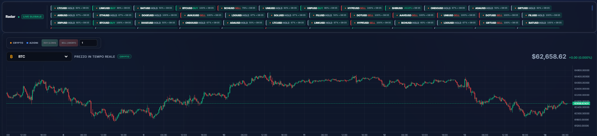
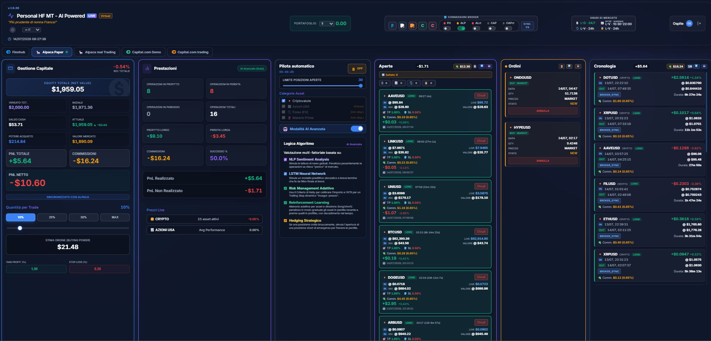
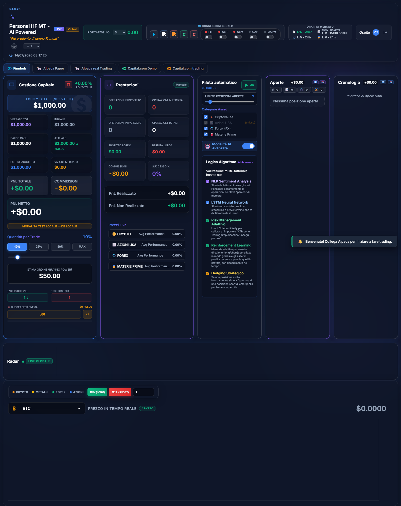

# Personal HF MT - Powered AI

[](https://github.com/diego01-lab/HF-MT-Personal-AI-Powered/actions/workflows/build.yml)

---

# English

Multi-asset, high-frequency algorithmic trading engine/simulator, with real-time market data, two selectable strategy modes (multi-indicator AI and classic EMA crossover) and optional connection to real trading accounts. Available as a **Web**, **Android** and **iOS** app from a single codebase (Capacitor).

> ⚠️ **Disclaimer**: this app is for **educational and demonstration purposes**. No signal, indicator or bot decision constitutes financial advice. **Test** and **Alpaca Paper** modes use only virtual money; **ALrt (Alpaca Live)** mode sends real orders with **real money**, is disabled by default, and requires your own API keys plus an explicit confirmation. Past or simulated performance is not indicative of future results. Full Terms of Service, EULA and Privacy Policy are available inside the app (Legal Notices section, 5 languages).


<sub>Guest session, Test mode, no broker keys configured — empty portfolio shown for illustration only.</sub>

## What it does

The bot monitors a basket of cryptocurrencies, stocks, forex pairs and commodities in real time, computes technical indicators (RSI, EMA, MACD, Bollinger Bands, ATR, momentum) and opens/closes positions automatically according to the selected strategy, with built-in risk management (dynamic stop loss/take profit, trailing stop, automatic break-even, hedging, budget and exposure limits). Everything is observable from a dashboard with a multi-asset radar, a live candlestick chart, trade history and CSV export.

## Key features

- **Two strategy engines**, selectable at runtime:
  - **AI Advanced**: multi-indicator scoring system (RSI, EMA, MACD, Bollinger Bands) requiring confirmation of a real event (not just trend continuation), optional simulated sentiment/LSTM/reinforcement-learning modules, TP/SL recalibrated in real time from current volatility, asymmetric cooldown after a loss, market-flatness filter (ATR).
  - **EMA Standard**: classic moving-average crossover (short/long EMA), simpler and more predictable.
- **Shared risk management** between both strategies (in `openTrade`): structural spread blacklist, entry spread cap, open-position limit, per-category diversification, session budget, circuit breaker on exhausted funds, anti-whipsaw blackout after a close.
- **Regular session for stocks** (09:30-16:00 EST): outside this window (pre-market/after-hours) new stock entries are blocked to avoid the illiquidity and wide spreads typical of those hours; already-open positions keep being managed.
- **Multi-asset radar** with live signals per category, horizontal and responsive down to narrow screens.
- **Candlestick chart** (Lightweight Charts) with overlaid indicators, history and real-time updates.
- **Capital Management and Performance dashboard**: equity, realized/unrealized PnL, net PnL, real commissions deduced from equity, total ROI, win rate — all metrics shared across panels come from a single source of truth to avoid mismatched values.
- **CSV export** (`;` separator, BOM for Excel) of History, Open Positions and Pending Orders, with an estimated commission per row.
- **Multi-language**: Italian, English, German, Spanish, French.
- **Multi-context**: several brokers/portfolios can run in parallel in the background (per-context "parallel" engines), not just the one shown in the foreground.
- **In-app notifications**, a counter of positions skipped by the bot (by reason: SHORT not allowed, insufficient cash, spread too wide, position limit, outside stock trading session, etc.).




<sub>Alpaca Paper account connected, bot active in AI Advanced mode — open positions, pending orders and history populated with real paper-trading activity (virtual money, no financial risk).</sub>

## Supported assets and brokers

| Category | Assets | Data/execution broker |
|---|---|---|
| Crypto | BTC, ETH, SOL, BNB, XRP, DOGE, ADA, MATIC, AVAX, LINK, DOT, UNI, LTC, ATOM, BCH, AAVE, BAT, GRT, MKR | Alpaca (Paper/Live), Finnhub (data) |
| Stocks | AAPL, MSFT, TSLA, NVDA, AMZN, GOOGL, META, NFLX, AMD, COIN, DIS, PYPL, BABA, NIO, INTC | Alpaca (Paper/Live), Finnhub (data) |
| Forex | EUR/USD, GBP/USD, USD/JPY, AUD/USD, USD/CAD, NZD/USD, USD/CHF, EUR/GBP, EUR/JPY, GBP/JPY | Capital.com (Demo/Live), OANDA via Finnhub (data) |
| Commodities | Gold, Silver, Brent, WTI, Natural Gas, Copper, Lithium | Capital.com (Demo/Live), OANDA via Finnhub (data) |

Operating modes available in the app: **Test** (local simulated portfolio), **Alpaca Paper** (Alpaca paper trading, fake funds), **ALrt / Alpaca Live** (real account, real money), **Capital.com Demo** and **Capital.com Live** (forex/commodity CFDs).



## Architecture

Single-page app, no framework/bundler: classic scripts loaded in order from `index.html`, state shared at the global scope (no ES modules).

```
index.html          Markup, CSP, script loading (order matters)
styles.css           Styles, responsive (14 breakpoints), dark theme
app.js               UI, application state, broker/data integrations, dashboard, CSV export
tengine.js           Trading engine: strategies, order open/close, risk management
grafico.js           Candlestick chart wrapper (Lightweight Charts), with fallback if the CDN is unreachable
radar.js             Multi-asset Radar panel logic
statusbar.js         Engine status bar (warm-up, last signal, FPS)
legal.js             Terms of Service / EULA / Privacy Policy (5 languages)
languages.*.json     Translated UI strings (it, en, de, es, fr)
brokers/             Adapters for Alpaca Paper/Live, Capital.com Demo/Live, Finnhub
server.js            Local HTTP/HTTPS server with a proxy to the Alpaca APIs (for testing on an emulator/device)
build.js             Generates the www/ folder (static bundle for Capacitor/Vercel)
sync-platforms.js    Syncs www/ into the native Android/iOS projects (also sets the correct per-platform server.url)
capacitor.config.json Capacitor configuration (appId, webDir, server)
*.test.js            Trading-logic regression tests (no framework, run with `node`)
```

> ⚠️ `tengine.js` **must** be loaded before `app.js` in `index.html`: it declares the trading engine at global scope, which `app.js` calls at runtime.

## Requirements

- Node.js 22+
- For Android: Android Studio / SDK, Java 21 (for the native build)
- For iOS: Xcode (macOS only)
- Your own API keys for whichever services you want to use: Finnhub (market data), Alpaca (Paper and/or Live), Capital.com (Demo and/or Live) — entered inside the app itself, stored locally, never included in the repository

## Running locally

```bash
npm install
npm start          # starts server.js (local HTTP/HTTPS, with a proxy to Alpaca)
```

## Build and deployment

```bash
npm run build          # generates www/ from the sources
npm run sync            # syncs www/ to Android and iOS
npm run sync:android    # Android only
npm run sync:ios         # iOS only
```

- **Web**: `www/` is ready to be served statically or deployed to Vercel (`vercel.json` already includes the proxy rewrites to the Alpaca APIs).
- **Android**: after `sync:android`, build/debug from Android Studio or Gradle (`android/`).
- **iOS**: after `sync:ios`, build from Xcode (`ios/App/`).
- **CI**: `.github/workflows/build.yml` automatically builds a debug Android APK and an iOS simulator app on every push to `main`.

## Tests

```bash
node check-history-logic.test.js   # broker history/multi-fill reconciliation
node test-tp-guard.test.js         # anti-churn take-profit guard (spread/net cost)
```

## License

Personal/demonstration use. See the Terms of Service and EULA inside the app for details. Contact: hftindividualaip@gmail.com

---

# Italiano

Simulatore/motore di trading algoritmico multi-asset ad alta frequenza, con dati di mercato in tempo reale, due modalità di strategia (AI multi-indicatore e incrocio EMA classico) e collegamento opzionale a conti di trading reali. Disponibile come app **Web**, **Android** e **iOS** a partire da un'unica base di codice (Capacitor).

> ⚠️ **Disclaimer**: l'app ha finalità **educative e dimostrative**. Nessun segnale, indicatore o decisione del bot costituisce consulenza finanziaria. Le modalità **Test** e **Alpaca Paper** usano solo denaro virtuale; la modalità **ALrt (Alpaca Live)** invia invece ordini reali con **denaro reale** ed è disattivata di default, richiede le chiavi API del proprio conto e una conferma esplicita. Performance passate o simulate non sono indicative di risultati futuri. Termini di Servizio, EULA e Privacy Policy completi sono disponibili nell'app (sezione Note Legali, 5 lingue).


<sub>Sessione Ospite, modalità Test, nessuna chiave broker configurata — portafoglio vuoto mostrato a solo scopo illustrativo.</sub>

## Cosa fa

Il bot monitora in tempo reale un paniere di criptovalute, azioni, coppie forex e materie prime, calcola indicatori tecnici (RSI, EMA, MACD, Bollinger Bands, ATR, momentum) e apre/chiude posizioni in automatico secondo la strategia scelta, con gestione del rischio integrata (stop loss/take profit dinamici, trailing stop, break-even automatico, hedging, limiti di budget ed esposizione). Tutto è osservabile da una dashboard con radar multi-asset, grafico a candele live, cronologia operazioni ed export CSV.

## Funzionalità principali

- **Due motori di strategia**, selezionabili a runtime:
  - **AI Avanzata**: sistema a punteggio multi-indicatore (RSI, EMA, MACD, Bollinger Bands) con conferma di evento reale (non solo continuazione di trend), moduli opzionali di sentiment/LSTM/reinforcement learning simulati, TP/SL ricalibrati in tempo reale sulla volatilità corrente, cooldown asimmetrico dopo una perdita, filtro di piattezza del mercato (ATR).
  - **EMA Standard**: incrocio classico di medie mobili (EMA corta/lunga), più semplice e prevedibile.
- **Gestione del rischio condivisa** tra le due strategie (in `openTrade`): blacklist spread strutturali, cap sullo spread d'ingresso, limite posizioni aperte, diversificazione per categoria, budget di sessione, circuit breaker su fondi esauriti, blackout anti-whipsaw dopo una chiusura.
- **Sessione regolare per le azioni** (09:30-16:00 EST): fuori da questa finestra (pre-market/after-hours) le nuove aperture azionarie sono bloccate per evitare l'illiquidità e lo spread ampio tipici di quelle ore; le posizioni già aperte restano comunque gestite.
- **Radar multi-asset** con segnali live per categoria, orizzontale e responsive anche su schermi stretti.
- **Grafico a candele** (Lightweight Charts) con indicatori sovrapposti, storico e aggiornamento in tempo reale.
- **Dashboard di Gestione Capitale e Prestazioni**: equity, PnL realizzato/non realizzato, PnL netto, commissioni reali dedotte dall'equity, ROI totale, tasso di successo — tutte le metriche condivise tra i pannelli usano un'unica fonte di verità per evitare valori disallineati.
- **Export CSV** (separatore `;`, BOM per Excel) di Cronologia, Posizioni Aperte e Ordini in attesa, con stima delle commissioni per riga.
- **Multi-lingua**: italiano, inglese, tedesco, spagnolo, francese.
- **Multi-contesto**: più broker/portafogli possono girare in parallelo in background (motori "paralleli" per contesto), non solo quello visualizzato in primo piano.
- **Notifiche in-app**, contatore delle posizioni saltate dal bot (per motivo: SHORT non permesso, cash insufficiente, spread troppo ampio, limite posizioni, fuori sessione di borsa, ecc.).


<sub>Conto Alpaca Paper collegato, bot attivo in modalità AI Avanzata — posizioni aperte, ordini in attesa e cronologia popolati con attività reale di paper trading (denaro virtuale, nessun rischio economico).</sub>

## Asset e broker supportati

| Categoria | Asset | Broker dati/esecuzione |
|---|---|---|
| Crypto | BTC, ETH, SOL, BNB, XRP, DOGE, ADA, MATIC, AVAX, LINK, DOT, UNI, LTC, ATOM, BCH, AAVE, BAT, GRT, MKR | Alpaca (Paper/Live), Finnhub (dati) |
| Azioni | AAPL, MSFT, TSLA, NVDA, AMZN, GOOGL, META, NFLX, AMD, COIN, DIS, PYPL, BABA, NIO, INTC | Alpaca (Paper/Live), Finnhub (dati) |
| Forex | EUR/USD, GBP/USD, USD/JPY, AUD/USD, USD/CAD, NZD/USD, USD/CHF, EUR/GBP, EUR/JPY, GBP/JPY | Capital.com (Demo/Reale), OANDA via Finnhub (dati) |
| Materie prime | Oro, Argento, Brent, WTI, Gas Naturale, Rame, Litio | Capital.com (Demo/Reale), OANDA via Finnhub (dati) |

Modalità operative disponibili in app: **Test** (portafoglio simulato locale), **Alpaca Paper** (paper trading Alpaca, fondi fittizi), **ALrt / Alpaca Live** (conto reale, denaro reale), **Capital.com Demo** e **Capital.com Reale** (CFD forex/materie prime).


## Architettura

App a pagina singola, senza framework/bundler: script classici caricati in ordine da `index.html`, stato condiviso a livello globale (nessun modulo ES).

```
index.html          Markup, CSP, caricamento script (ordine significativo)
styles.css           Stili, responsive (14 breakpoint), tema dark
app.js               UI, stato applicativo, integrazioni broker/dati, dashboard, export CSV
tengine.js           Motore di trading: strategie, apertura/chiusura ordini, gestione rischio
grafico.js           Wrapper del grafico a candele (Lightweight Charts), con fallback se il CDN non è raggiungibile
radar.js             Logica del pannello Radar multi-asset
statusbar.js         Barra di stato del motore (warm-up, ultimo segnale, FPS)
legal.js             Termini di Servizio / EULA / Privacy Policy (5 lingue)
languages.*.json     Stringhe UI tradotte (it, en, de, es, fr)
brokers/             Adapter per Alpaca Paper/Live, Capital.com Demo/Reale, Finnhub
server.js            Server locale HTTP/HTTPS con proxy verso le API Alpaca (per test su emulatore/dispositivo)
build.js             Genera la cartella www/ (bundle statico per Capacitor/Vercel)
sync-platforms.js    Sincronizza www/ verso i progetti nativi Android/iOS (imposta anche il server.url corretto per piattaforma)
capacitor.config.json Configurazione Capacitor (appId, webDir, server)
*.test.js            Test di regressione della logica di trading (nessun framework, eseguibili con `node`)
```

> ⚠️ `tengine.js` **deve** essere caricato prima di `app.js` in `index.html`: dichiara a scope globale il motore di trading che `app.js` richiama a runtime.

## Requisiti

- Node.js 22+
- Per Android: Android Studio / SDK, Java 21 (per la build nativa)
- Per iOS: Xcode (solo su macOS)
- Chiavi API personali per i servizi che si vogliono usare: Finnhub (dati di mercato), Alpaca (Paper e/o Live), Capital.com (Demo e/o Reale) — inserite dall'app stessa, salvate in locale, mai incluse nel repository

## Avvio in locale

```bash
npm install
npm start          # avvia server.js (HTTP/HTTPS locale, con proxy verso Alpaca)
```

## Build e distribuzione

```bash
npm run build          # genera www/ dai sorgenti
npm run sync            # sincronizza www/ su Android e iOS
npm run sync:android    # solo Android
npm run sync:ios         # solo iOS
```

- **Web**: `www/` è pronta per essere servita staticamente o distribuita su Vercel (`vercel.json` include già i rewrite di proxy verso le API Alpaca).
- **Android**: dopo `sync:android`, build/debug da Android Studio o Gradle (`android/`).
- **iOS**: dopo `sync:ios`, build da Xcode (`ios/App/`).
- **CI**: `.github/workflows/build.yml` builda automaticamente un APK Android di debug e un'app iOS per simulatore ad ogni push su `main`.

## Test

```bash
node check-history-logic.test.js   # riconciliazione cronologia/fill multipli dal broker
node test-tp-guard.test.js         # anti-churn sul take-profit (spread/costi netti)
```

## Licenza

Uso personale/dimostrativo. Vedi Termini di Servizio ed EULA nell'app per i dettagli. Contatto: hftindividualaip@gmail.com
